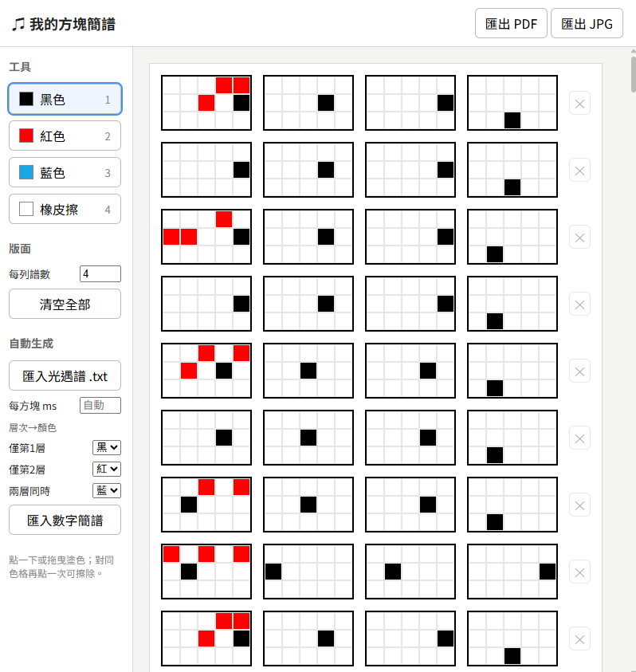

# ♫ 我的方塊簡譜

一個專門將《Sky 光·遇》樂譜轉換成方塊簡譜的線上工具。

不需要安裝任何軟體，開啟網頁即可編輯、儲存與匯出樂譜。

## 線上使用

🌐 https://anna0212anna0212.github.io/sky/


## 畫面預覽




## 專案特色

### 方塊簡譜編輯器

- 每個方塊為 **5 × 3 共 15 鍵**
- 支援：
  - 黑色（第 1 層）
  - 紅色（第 2 層）
  - 藍色（雙層同時）
- 點擊或拖曳即可快速繪製
- 再次點擊同顏色可直接擦除
- 支援橡皮擦工具

### 快捷鍵

| 按鍵 | 功能 |
|--------|--------|
| 1 | 黑色 |
| 2 | 紅色 |
| 3 | 藍色 |
| 4 或 0 | 橡皮擦 |


## 光遇譜匯入

支援匯入由 **Sky Studio** 匯出的譜面檔案。

### 支援格式

- `.txt`
- `.json`

類似格式:
```text
6 15 j 10 14 j 13 15 j 14 j 4 15 j 8 12 j 11 15 j 11 l d 8 l 10 l 6 15 j 10 14 j 13 15 j 14
```
```text
[{"time":0,"key":"1Key8"},{"time":260,"key":"1Key9"},{"time":520,"key":"1Key14"}]
```
```text
A1A4B1 . . . . . . . . . . . . . B3 . . . . . . . . . . . A3B1B4 . . . . . . . . . . . . . . . A3A5B2B5
```
```text
[75,89,-22,98,43,90,126,-21,43,24,14,22,77,56,82,57,68,19,5,93,64,123,71,-31,100,48,137]
```
| 格式                     | 辨識方式                                   | 狀態            |
|--------------------------|--------------------------------------------|-----------------|
| Sky Studio JSON          | 以 [ 或 { 開頭，且含 songNotes             | 完整支援        |
| 方格文字                 | 幾乎每個詞都是 . 或 A1~C5                  | 支援            |
| 數字加字母               | 其他情況                                   | 支援，但節拍是我猜的 |
| 純數字陣列               | 整串都是數字的 JSON                        | 無法轉換，會顯示提示 |


### 說明

本工具所使用的樂譜來源為：

> Sky Studio 匯出的譜面檔案

匯入後會自動：

- 分析音符時間
- 推算節拍間隔（ms）
- 轉換成方塊簡譜
- 自動建立多列譜面

使用者也可以自行調整：

- 每方塊毫秒數
- 顏色對應規則
- 雙層顯示方式

🌟使用 Sky Studio 譜面，要注意到譜面的按鍵顏色可能就不是節拍順序！是依照傳入的檔案進行設定！


## 數字簡譜匯入

### 格式規則

- 空格分隔每個方塊
- 和弦使用 `+`
- `0` 為休止符
- `'` 為高八度
- `,` 為低八度

範例：

```text
1 3+5 0 6' 2'+4'
```
(可以先把簡譜圖片給ai，讓他變成如此文字格式再貼入)
