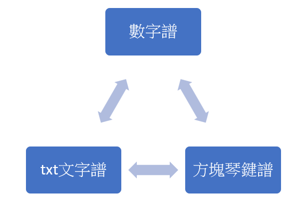
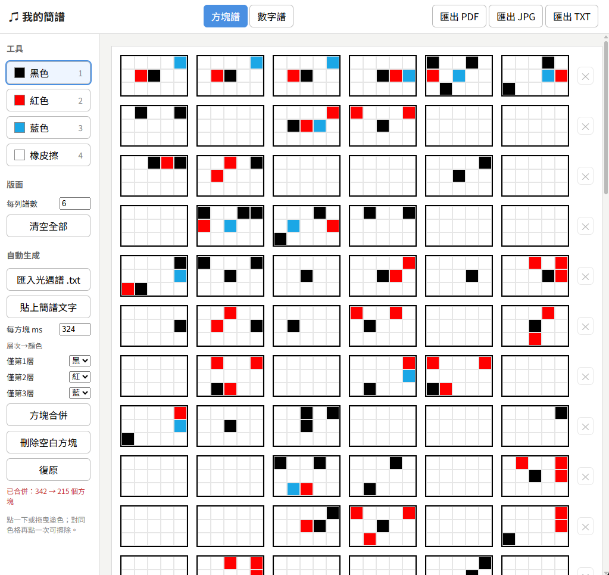
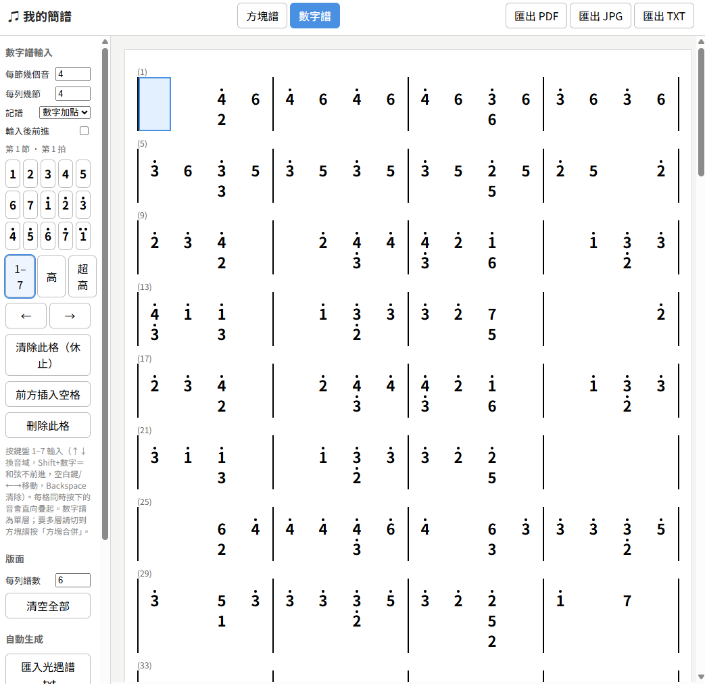
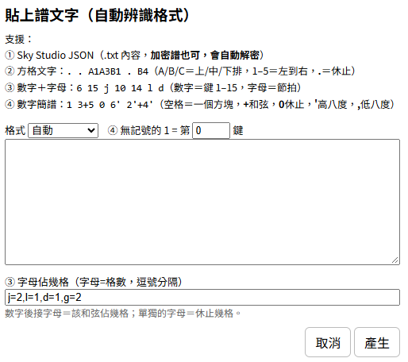

# ♫ 我的方塊簡譜

一個專門將《Sky 光·遇》樂譜轉換成方塊、數字簡譜的線上工具。

不需要安裝任何軟體，開啟網頁即可編輯、儲存與匯出樂譜。

## 線上使用

🌐 https://anna0212anna0212.github.io/sky/


## 畫面預覽




## 專案特色

### 方塊簡譜編輯器

- 每個方塊為 **5 × 3 共 15 鍵**
- 支援：
  - 黑色（第 1 層）
  - 紅色（第 2 層）
  - 藍色（第 3 層）
- 點擊或拖曳即可快速繪製
- 再次點擊同顏色可直接擦除
- 支援橡皮擦工具

### 快捷鍵

| 按鍵 | 功能 |
|--------|--------|
| 1 | 黑色 |
| 2 | 紅色 |
| 3 | 藍色 |
| 4 或 0 | 橡皮擦 |


## 光遇譜匯入
### 支援格式

- `.txt`
- `.json`

✅支援匯入由 **Sky Studio** 匯出的譜面檔案。(加密譜也可，會自動解密）

✅可以使用的類似格式:

```[{"time":0,"key":"1Key8"},{"time":260,"key":"1Key9"},{"time":520,"key":"1Key14"}]```

```A1A4B1 . . . . . . . . . . . . . B3 . . . . . . . . . . . A3B1B4 . . . . . . . . . . . . . . . A3A5B2B5```

```6 15 j 10 14 j 13 15 j 14 j 4 15 j 8 12 j 11 15 j 11 l d 8 l 10 l 6 15 j 10 14 j 13 15 j 14```

```[75,89,-22,98,43,90,126,-21,43,24,14,22,77,56,82,57,68,19,5,93,64,123,71,-31,100,48,137]```

| 格式                     | 辨識方式                                   | 狀態            |
|--------------------------|--------------------------------------------|-----------------|
| Sky Studio JSON          | 以 [ 或 { 開頭，且含 songNotes             | 完整支援        |
| 方格文字                 | 幾乎每個詞都是 . 或 A1~C5                  | 支援            |
| 數字加字母               | 其他情況，6 15 j 10                         | 支援，但節拍是我猜的 |
| 純數字陣列               | 整串都是數字的 JSON                        | ⭐支援，最新更新! |


### 說明

匯入後會自動：

- 分析音符時間
- 推算節拍間隔（ms）
- 轉換成方塊簡譜
- 自動建立多列譜面

使用者也可以自行調整：

- 每方塊毫秒數
- 顏色對應規則
- 雙層顯示方式

🌟使用 Sky Studio 譜面，要注意到譜面的按鍵顏色可能就不是節拍順序！是依照傳入的檔案進行設定！


## 貼上譜文字（自動辨識格式）

### 格式規則

支援：
① Sky Studio JSON（.txt 內容，加密譜也可，會自動解密）
② 方格文字：. . A1A3B1 . B4（A/B/C＝上/中/下排，1–5＝左到右，.＝休止）
③ 數字＋字母：6 15 j 10 14 l d（數字＝鍵 1–15，字母＝節拍）
④ 數字簡譜：1 3+5 0 6' 2'+4'（空格＝一個方塊，+和弦，0休止，'高八度，,低八度）
- 空格分隔每個方塊
- 和弦使用 `+`
- `0` 為休止符
- `'` 為高八度
- `,` 為低八度

範例：

```text
1 3+5 0 6' 2'+4'
```

(可以先把簡譜圖片給ai，讓他變成如此文字格式再貼入)

## 方塊合併 
⛔(切換到數字譜會取消合併，感覺數字譜應該沒有人在看合併譜的，有一點怪怪的)

將連續的方塊依照時間順序合併，透過不同層次的顏色呈現音符資訊，讓樂譜更容易閱讀。

- 第 1 層：黑色
- 第 2 層：紅色
- 第 3 層：藍色
- 🌟空白方塊代表休止，不會自動合併，並保留原本位置。
  如果想要全部合併，可以先按「刪除空白方塊」再合併即可。
- 提供「刪除空白方塊」功能，可依需求整理譜面。
- 合併完成後可使用「復原」功能，還原合併前的樂譜。

對已合併的樂譜再次執行合併時，系統會將現有顏色視為黑色並重新計算層次，因此若不希望原有層次被重新拆分，建議使用復原功能。

## 數字譜

提供更直觀的數字簡譜輸入方式，讓使用者可以直接使用數字編寫音符，不必逐格手動塗色。

### 音符輸入方式

- 使用鍵盤 `1～7` 輸入音符。
- 可點擊右側數字鍵盤輸入。
- 使用 `↑／↓` 切換音域。
- 使用 `←／→` 或空白鍵移動拍點。
- 搭配 `Shift` 可在同一拍輸入和弦。

### 記譜與版面設定

提供三種記譜顯示方式：

- 數字加點
- 高音記號
- A～C 搭配數字

此外，也可以自訂每小節的拍數，以及每列顯示的小節數，依照歌曲節奏與版面需求調整樂譜。

## 更新：樂譜播放與試聽

提供樂譜播放功能，可以在編輯完成後直接試聽旋律，檢查音符、音高與節奏是否符合預期，減少反覆修改與實際進入遊戲測試的時間。

**播放設定**

- **▶ 播放：** 播放目前編寫的樂譜，方便預覽旋律與檢查音符。
- **音高（1 =）：** 設定數字 `1` 對應的音高位置，可依照需要調整整首曲子的音域。
- **調性（C 等）：** 可選擇不同的調性，包含升降記號等設定，方便調整樂曲的音高配置。
- **音色（鋼琴）：** 提供多種音色選擇，讓使用者可以嘗試不同的聲音效果。
- **播放速度（倍速）：** 可調整播放倍速，方便慢速確認音符、練習節奏，或加快速度預覽完整曲目。
- **多層依序播放：** 可勾選是否依照不同音符層次依序播放，方便分層聆聽與檢查各層音符。

**使用提醒**

本功能主要用於樂譜預覽與編寫輔助。由於瀏覽器合成音色與《Sky 光·遇》遊戲內的實際樂器音色存在差異🥲播放效果可能無法完全還原遊戲中的聲音，請以遊戲內實際演奏效果為準。

# 聯繫我
若您在使用此程式時遇到任何問題或有建議，歡迎隨時聯繫我：

✉️電子郵件：yim20000101@gmail.com
